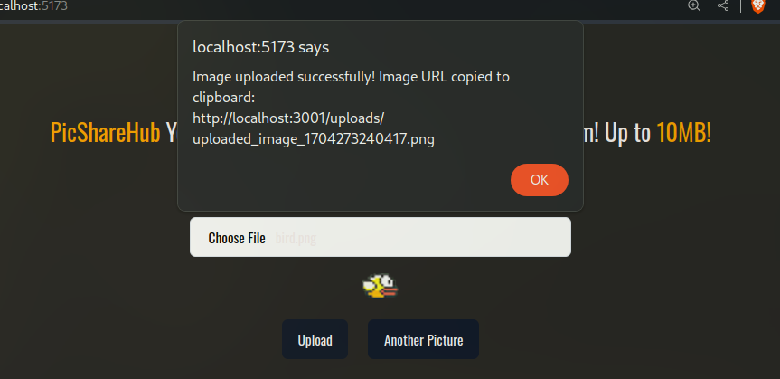

# PicShareHub - Simple Image Exchange Platform

## Overview
PicShareHub is a straightforward and engaging platform for sharing images with others. Users can easily upload images, and the platform provides a convenient way to share the uploaded image's URL. The project consists of a React frontend for user interaction and a Node.js backend for image handling and storage.

## Review

## How It Works
1. **Image Selection**: Users can select an image file using the provided file input. The frontend checks if the selected file is an image and if its size is within the specified limit (10 MB).

2. **Preview**: Upon a valid image selection, the platform displays a preview of the selected image.

3. **Upload**: Users can upload the selected image. The frontend sends the image data to the backend using a POST request to the `/upload` endpoint.

4. **Backend Processing**: The backend receives the image data, converts it to a file, and saves it to the server. The server responds with the filename.

5. **URL Generation**: The frontend constructs the URL for the uploaded image using the filename and displays it. Additionally, the URL is copied to the user's clipboard for easy sharing.

6. **Another Picture**: Users can choose to upload another picture, resetting the selection and allowing for the upload of a new image.

## Tech Stack

### Frontend (React)
- React: JavaScript library for building user interfaces.
- React Icons: Icon library for including icons in the UI.
- Radix UI: UI primitives for building accessible design systems.
- Tailwind CSS: Utility-first CSS framework for styling.

### Backend (Node.js)
- Express: Web application framework for Node.js.
- Cors: Middleware for enabling Cross-Origin Resource Sharing.
- Body Parser: Middleware for parsing incoming request bodies.
- fs.promises: File system module for handling file operations.
- EJS: Templating engine for rendering server-side views.

